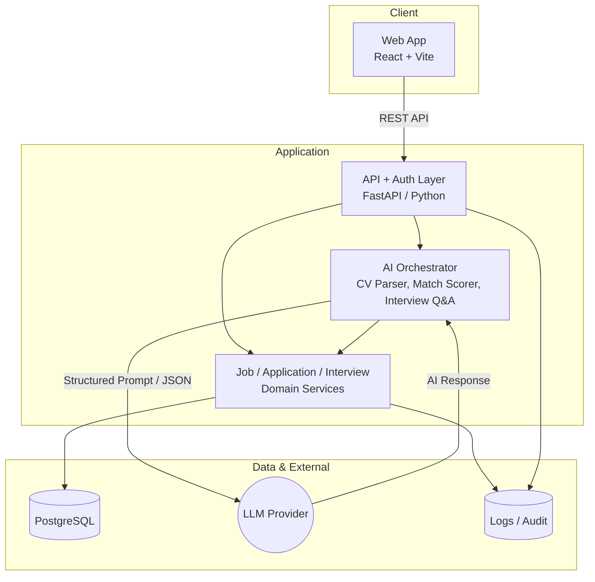

# Architecture

## Business Rules

- LLM không truy cập DB trực tiếp; các yêu cầu AI (parse CV, tính Match Score, sinh câu hỏi phỏng vấn) đi qua AI Orchestrator — Orchestrator chuẩn bị prompt, gọi LLM, nhận JSON và chuyển cho Domain Service xử lý

- Application layer validate quyền theo Role (Admin, Recruiter, Interviewer, Hiring Manager, Candidate) và dữ liệu đầu vào/business rules trước khi ghi DB

- Job, Application, Interview Domain Services là source-of-truth cho trạng thái ứng viên; mọi AI suggestion (Match Score, Q&A) chỉ mang tính tham khảo — quyết định cuối cần explicit confirmation từ người dùng (VD: Recruiter xác nhận Pass/Reject)

- Mỗi lần AI sinh kết quả có thể ảnh hưởng quyết định con người (Match Score, Interview Questions) được lưu thành bản ghi mới (append-only), không ghi đè bản ghi cũ

- Mọi hành động quan trọng (tạo Job, đổi trạng thái Application, Submit Scorecard, tạo Offer, Confirm Offer) ghi vào Audit Log kèm `actor_id` và timestamp
