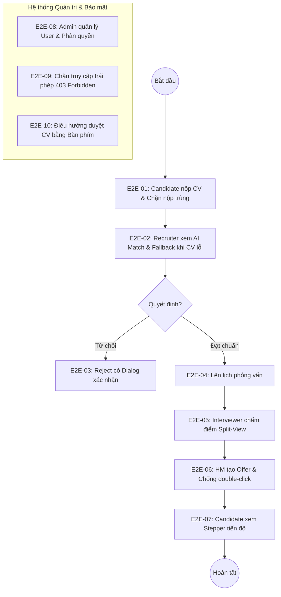

# E2E Scenario 

## Kịch bản cốt lõi: Quy trình Tuyển dụng An toàn với Trợ lý AI (Core E2E Scenario)

```gherkin
Scenario: recruiter and candidate complete safe AI-assisted recruitment pipeline
Given candidate is logged in with email "candidate@ats.demo"
And job posting "Backend Developer" is status "PUBLISHED"
When candidate submits application with CV file "cv-backend-developer.pdf"
Then application is created with status "NEW"
When recruiter logs in and opens candidate application
Then screen displays AI Match Score 85 with advisory label "AI Suggestion"
And screen displays matched skills "Java, Spring Boot, Docker" and missing skills "Redis"
And application status remains "NEW" without any automatic mutation
When recruiter reviews raw CV and chooses "Duyệt hồ sơ (Pass)"
Then application status updates to "SCREENING_PASSED"
When recruiter schedules interview round with interviewer "interviewer@ats.demo"
And interviewer submits scorecard with score 85 and notes "Nắm vững kiến thức backend"
Then application status updates to "INTERVIEWING"
When hiring manager creates offer with salary 25,000,000 VND
Then app displays Offer Draft and text "Bản thảo — Chưa gửi"
And no Offer record is confirmed yet
When hiring manager chooses "Xác nhận gửi Offer"
Then one Offer is confirmed with authoritative salary snapshot
And candidate pipeline stepper shows "Đã nhận Offer"
And audit events include CREATE_APPLICATION, SCREEN_PASS, SCHEDULE_INTERVIEW, SUBMIT_SCORECARD, and OFFER_CONFIRMED
```

---

# BỘ KỊCH BẢN E2E TOÀN DIỆN CHO HỆ THỐNG SMART RECRUITMENT ATS

Tài liệu này bao quát đầy đủ tất cả các luồng người dùng (User Journeys) từ đầu đến cuối trên giao diện web, tích hợp đầy đủ các nguyên tắc an toàn **Human-in-the-loop**, **Explicit Confirmation** và **Role-Based Access Control**.



---

### E2E-01. Candidate Nộp Hồ Sơ & Cơ Chế Chặn Nộp Trùng Lặp (Duplicate Apply Guard)
* **User Story liên kết:** `US-ATS-02` (Candidate Apply) & `REQ-ATS-02`
* **Mục tiêu:** Đảm bảo ứng viên nộp CV thành công khi file hợp lệ và bị chặn nộp 2 lần cho cùng một vị trí.

```gherkin
Scenario: candidate applies for a published job and duplicate submission is blocked
Given candidate "minh.anh@gmail.com" is logged in
And is on the job portal page "/jobs"
When candidate views job "Frontend Developer" with status "PUBLISHED"
And clicks "Ứng tuyển ngay"
Then app navigates to "/apply" with job preselected
When candidate attaches CV file "MinhAnh_CV_React.pdf" with size 1.8MB
And clicks "Gửi hồ sơ ứng tuyển"
Then system creates one Application record with status "NEW"
And toast notification displays "Nộp hồ sơ ứng tuyển thành công"
And app redirects to application tracking page
When candidate re-opens the application form for "Frontend Developer"
And attempts to submit another CV file "MinhAnh_CV_v2.pdf"
Then system blocks submission with HTTP 409 Conflict
And alert message displays "Bạn đã nộp đơn ứng tuyển cho vị trí này rồi"
And no duplicate Application record is created in database
And audit log records CREATE_APPLICATION and DUPLICATE_APPLY_BLOCKED
```

---

### E2E-02. Recruiter Lọc Hồ Sơ Với AI Match & Cơ Chế Fallback Khi CV Hỏng (BR-ATS-01 & BR-ATS-02)
* **User Story liên kết:** `US-ATS-05` (AI Match Score), `BR-ATS-01`, `BR-ATS-02`, `REQ-ATS-03`
* **Mục tiêu:** AI phân tích kỹ năng minh bạch, không tự động đổi trạng thái và có cơ chế fallback an toàn khi file CV scan không đọc được text.

```gherkin
Scenario: recruiter screens candidate with AI skill breakdown and safe fallback
Given recruiter "recruiter@ats.demo" is logged in
And navigates to Application Dashboard "/applications"
When recruiter filters applications by job "Backend Developer"
And opens candidate "Nguyễn Minh Anh" application
Then backend parses CV text and calculates match against requirements "Java, Spring Boot, Docker, Git"
And UI displays MatchScoreBadge with score "75%" in green styling
And advisory label states "AI Suggestion — Hỗ trợ quyết định, cần con người xác nhận"
And UI displays matched skills tags "Java", "Spring Boot", "Git" in solid green
And UI displays missing skills tags "Docker" in dashed red
And Application status strictly remains "NEW" without auto-advancing
When recruiter opens another application with scanned image CV "scan-cv.pdf"
Then AI engine detects no extractable text stream
And UI displays MatchScoreBadge with status "INSUFFICIENT_DATA" and no fake score
And an alert informs "Không thể trích xuất text từ CV. Vui lòng xem bản gốc"
And a prominent button "Xem CV bản gốc" is displayed
When recruiter clicks "Xem CV bản gốc"
Then raw PDF viewer opens in side modal allowing full manual review
And recruiter clicks "Duyệt hồ sơ (Pass Screening)" manually
Then Application status updates to "SCREENING_PASSED"
And audit log records SCREEN_PASS with actor_id "recruiter@ats.demo"
```

---

### E2E-03. Recruiter Từ Chối Hồ Sơ Có Hộp Thoại Xác Nhận (Anti-Accidental Click Reject)
* **User Story liên kết:** `US-ATS-06` (Screening Decision) & `BR-ATS-03`
* **Mục tiêu:** Chống thao tác bấm nhầm nút từ chối hồ sơ làm ảnh hưởng cơ hội của ứng viên.

```gherkin
Scenario: recruiter rejects candidate with explicit confirmation dialog
Given recruiter "recruiter@ats.demo" is logged in
And is reviewing application for candidate "Lê Hoàng Long"
When recruiter clicks red button "Từ chối hồ sơ"
Then Application status does not change immediately
And a modal dialog opens with title "Xác nhận từ chối hồ sơ"
And dialog message displays "Hành động này sẽ gửi thông báo từ chối đến ứng viên. Bạn có chắc chắn không?"
And dialog presents two actions: "Hủy bỏ" and "Xác nhận từ chối"
When recruiter presses "Escape" or clicks "Hủy bỏ"
Then modal dialog closes and application status remains unchanged
When recruiter clicks "Từ chối hồ sơ" again and clicks "Xác nhận từ chối"
Then modal dialog closes with a loading spinner
And backend updates Application status to "REJECTED"
And toast notification displays "Đã từ chối hồ sơ ứng viên"
And audit log records SCREEN_REJECT with reason and timestamp
```

---

### E2E-04. Lên Lịch Phỏng Vấn & Ngăn Chặn Xếp Lịch Cho Hồ Sơ Chưa Đạt
* **User Story liên kết:** `US-ATS-07` (Interview Schedule)
* **Mục tiêu:** Đảm bảo chỉ ứng viên đã qua vòng lọc hồ sơ mới được lên lịch phỏng vấn và ngăn chặn xung đột lịch.

```gherkin
Scenario: recruiter schedules interview round for passed candidate
Given recruiter "recruiter@ats.demo" is logged in
And candidate "Trần Thị Mai" has application status "SCREENING_PASSED"
When recruiter clicks "Lên lịch phỏng vấn"
Then app opens "/schedule-interview" with candidate details
When recruiter selects interviewer "interviewer@ats.demo"
And picks date "2026-10-05" and time "14:30"
And clicks "Tạo lịch phỏng vấn"
Then backend validates candidate is eligible for interview
And one InterviewRound record is created with status "SCHEDULED"
And Application status updates to "INTERVIEWING"
And success banner displays "Lịch phỏng vấn đã được gửi đến người phỏng vấn"
When recruiter attempts to schedule an interview for another candidate with status "NEW"
Then system displays error "Ứng viên chưa vượt qua vòng duyệt hồ sơ"
And action is blocked
```

---

### E2E-05. Interviewer Chấm Điểm Qua Giao Diện Split-View & Khóa Sau Khi Nộp
* **User Story liên kết:** `US-ATS-08`, `US-ATS-09` (Scorecard Submission)
* **Mục tiêu:** Người phỏng vấn vừa xem CV vừa chấm điểm, lưu bản ghi độc lập và khóa chỉnh sửa sau khi gửi.

```gherkin
Scenario: interviewer completes scorecard in split-view layout and locks submission
Given interviewer "interviewer@ats.demo" is logged in
And has an assigned interview round for candidate "Trần Thị Mai"
When interviewer navigates to "/scorecard"
Then app renders a split-view layout:
  | Left Panel  | Embedded scrollable CV viewer and AI question suggestions |
  | Right Panel | Scorecard grading form with score criteria and notes      |
When interviewer adjusts question suggestions and fills technical evaluation
And enters score "88" out of 100
And enters notes "Ứng viên nắm chắc kiến thức cơ sở dữ liệu, giải quyết thuật toán tốt"
And clicks "Hoàn tất chấm điểm"
Then system creates one Scorecard record linked to the InterviewRound
And scorecard form becomes read-only with a lock icon
And text displays "Đã nộp đánh giá vào lúc [timestamp]"
When interviewer reloads the page
Then score "88" and notes remain displayed in disabled state
And no second Scorecard can be created for the same interview round
And audit log records SUBMIT_SCORECARD
```

---

### E2E-06. Hiring Manager Phê Duyệt Offer Lương & Chống Double-Click (BR-ATS-03 & Idempotency)
* **User Story liên kết:** `US-ATS-10`, `US-ATS-11` (Offer Approval) & `BR-ATS-03`
* **Mục tiêu:** Tổng hợp đầy đủ Scorecard trước khi tạo Offer, ngăn chặn gửi đúp bằng token xác thực.

```gherkin
Scenario: hiring manager reviews scorecards and issues confirmed offer safely
Given hiring manager "hm@ats.demo" is logged in
And navigates to "/scorecard-summary" for candidate "Trần Thị Mai"
Then UI displays aggregated table of all completed interview rounds with average score "88/100"
When hiring manager clicks "Tạo đề xuất tuyển dụng (Offer)"
Then app navigates to "/offer-approval"
When hiring manager enters base salary "28,000,000" VND
Then app displays Offer status as "DRAFT" and label "Bản thảo — Chưa xác nhận"
And candidate cannot view this draft offer yet
When hiring manager clicks "Xác nhận gửi Offer"
Then button immediately becomes disabled showing a loading spinner
And backend generates a cryptographic confirmation token
And updates Offer status to "CONFIRMED"
And updates Application status to "OFFERED"
And success modal confirms "Offer tuyển dụng 28,000,000 VND đã được gửi chính thức"
When user rapidly double-clicks the confirm button
Then second request is rejected by idempotency check with HTTP 409
And exactly one Offer record exists in the database
And audit log records CREATE_OFFER and CONFIRM_OFFER
```

---

### E2E-07. Ứng Viên Theo Dõi Tiến Trình Tuyển Dụng Qua Stepper (Candidate Transparency)
* **User Story liên kết:** `US-ATS-12` (Pipeline Status Tracking)
* **Mục tiêu:** Ứng viên theo dõi minh bạch từng giai đoạn hồ sơ mà không nhìn thấy các dữ liệu nhạy cảm nội bộ.

```gherkin
Scenario: candidate monitors recruitment pipeline progression
Given candidate "minh.anh@gmail.com" is logged in
When candidate navigates to "/apply"
Then app renders a 4-step PipelineStatusStepper:
  | Step 1 | Đã nộp hồ sơ     | Completed (Green) |
  | Step 2 | Duyệt hồ sơ      | Completed (Green) |
  | Step 3 | Phỏng vấn        | Completed (Green) |
  | Step 4 | Đề xuất Offer    | Active (Blue)     |
And screen displays official offer status "Chúc mừng! Bạn đã nhận được lời mời làm việc"
And internal AI match scores and interviewer internal notes are strictly hidden from candidate
```

---

### E2E-08. Admin Quản Lý Tài Khoản, Phân Quyền RBAC & Khóa Truy Cập (Admin RBAC Management)
* **User Story liên kết:** `US-ATS-13` (User Management & RBAC)
* **Mục tiêu:** Admin có thể thay đổi vai trò hoặc vô hiệu hóa tài khoản, tài khoản bị khóa lập tức bị chặn đăng nhập.

```gherkin
Scenario: admin manages user roles and revokes login access
Given admin "admin@ats.demo" is logged in
And navigates to Admin User Management "/admin-users"
Then app renders table of all users with Email, Role, Status, and Action controls
When admin locates user "quynh.recruiter@ats.demo"
And changes role from "RECRUITER" to "HIRING_MANAGER" via role dropdown
Then backend updates user role in database
And table row updates with a green toast "Đã cập nhật vai trò thành công"
When admin toggles the "Vô hiệu hóa tài khoản" switch to ON for "spam.user@ats.demo"
Then backend sets user field "disabled: true"
And user row reflects disabled status in grayed-out badge
When "spam.user@ats.demo" attempts to log in via "/api/auth/login"
Then backend rejects request with HTTP 403 Forbidden
And error message displays "Tài khoản của bạn đã bị vô hiệu hóa"
And audit log records ADMIN_UPDATE_ROLE and ADMIN_DISABLE_USER
```

---

### E2E-09. Chặn Truy Cập Trái Phép Theo Ma Trận Phân Quyền (Security Boundary Violation Check)
* **User Story liên kết:** `NFR-ATS-03` (Security & Authorization)
* **Mục tiêu:** Đảm bảo người dùng ở vai trò thấp không thể truy cập trái phép tài nguyên đặc quyền thông qua URL hoặc API trực tiếp.

```gherkin
Scenario: candidate tries to access recruiter or admin endpoints and is rejected
Given candidate is logged in with valid token
When candidate attempts to navigate directly to "/admin-users" in browser
Then frontend route guard intercepts request
And redirects candidate to "/apply" with error toast "Bạn không có quyền truy cập trang này"
When candidate uses API tool to send GET request to "http://localhost:3001/api/admin/users"
Then backend requireRole middleware checks token claims
And returns HTTP 403 Forbidden with {"error": "Không có quyền truy cập"}
When candidate attempts to send POST request to "/api/jobs" to create a job
Then backend rejects with HTTP 403 Forbidden
And no new job is created in database
And audit log records SECURITY_UNAUTHORIZED_ACCESS_ATTEMPT
```

---

### E2E-10. Hoàn Tất Toàn Bộ Quy Trình Duyệt Bằng Bàn Phím (WCAG 2.1 AA Keyboard Flow)
* **User Story liên kết:** `NFR-ATS-05` (Keyboard Flow & Accessibility)
* **Mục tiêu:** Đảm bảo chuyên viên tuyển dụng có thể thao tác toàn bộ quy trình lọc hồ sơ mà không cần dùng chuột.

```gherkin
Scenario: recruiter completes screening decision using keyboard navigation only
Given recruiter is on "/applications" with mouse detached
When recruiter presses "Tab" to navigate into the applications table
Then visual focus ring highlights the first candidate row
When recruiter presses "Enter"
Then app opens the candidate review modal
And keyboard focus is automatically trapped inside the modal
When recruiter presses "Tab" sequentially
Then focus moves smoothly through:
  | Target 1 | AI Match Score badge tooltip trigger |
  | Target 2 | "Xem CV bản gốc" button              |
  | Target 3 | "Từ chối" button                     |
  | Target 4 | "Duyệt hồ sơ" button                 |
When focus is on "Duyệt hồ sơ" and recruiter presses "Enter"
Then application status updates to "SCREENING_PASSED"
And toast message is announced by screen reader
When recruiter presses "Esc"
Then modal closes and focus returns to the table row in main window
```

---

## BẢNG MA TRẬN ÁNH XẠ E2E SCENARIOS VỚI CÁC USER STORIES & GUARDRAILS

| Mã Scenario | Tên Kịch Bản E2E | User Story | Business Rules & Guardrails | Test Mode |
| :---: | :--- | :---: | :---: | :---: |
| **Output #27** | Kịch bản tuyển dụng an toàn mẫu cốt lõi | `US-ATS-05`, `US-ATS-06`, `US-ATS-11` | `BR-ATS-01`, `BR-ATS-02`, `BR-ATS-03` | Automated / Playwright |
| **E2E-01** | Nộp hồ sơ và Chặn nộp trùng lặp | `US-ATS-02` | `REQ-ATS-02`, State constraint | Automated / Playwright |
| **E2E-02** | Lọc CV với AI Match & Fallback file hỏng | `US-ATS-03`, `US-ATS-05` | `BR-ATS-01`, `BR-ATS-02`, `REQ-ATS-03` | Automated / Playwright |
| **E2E-03** | Từ chối hồ sơ với Confirm Dialog | `US-ATS-06` | `BR-ATS-03`, Human Confirm | Automated / Playwright |
| **E2E-04** | Lên lịch phỏng vấn & Kiểm tra điều kiện | `US-ATS-07` | State transition check | Automated / Playwright |
| **E2E-05** | Chấm điểm qua Split-View & Khóa nộp | `US-ATS-08`, `US-ATS-09` | 1-to-1 Scorecard constraint | Automated / Playwright |
| **E2E-06** | Tạo Offer & Chống Click đúp | `US-ATS-10`, `US-ATS-11` | `BR-ATS-03`, Idempotency Token | Automated / Playwright |
| **E2E-07** | Candidate theo dõi Stepper tiến độ | `US-ATS-12` | Information Privacy | Automated / Playwright |
| **E2E-08** | Admin quản trị tài khoản & Phân quyền | `US-ATS-13` | RBAC Policy | Automated / Playwright |
| **E2E-09** | Chặn truy cập trái phép bảo mật | `NFR-ATS-03` | OWASP Broken Access Control | Automated / Playwright |
| **E2E-10** | Trải nghiệm duyệt hồ sơ bằng Bàn phím | `NFR-ATS-05` | WCAG 2.1 AA Accessibility | Manual / E2E |

---

## HƯỚNG DẪN THỰC THI KIỂM THỬ E2E TỰ ĐỘNG (PLAYWRIGHT)

Tất cả các kịch bản trên có thể được tự động hóa bằng **Playwright Test**:

```bash
# 1. Khởi động hệ thống (ở 2 terminal riêng)
npm run api     # Backend port 3001
npm run web     # Frontend port 3000

# 2. Chạy toàn bộ kịch bản E2E kiểm thử tự động
npx playwright test

# 3. Chạy từng kịch bản cụ thể với giao diện trực quan (UI mode)
npx playwright test --ui

# 4. Xuất báo cáo kết quả kiểm thử HTML
npx playwright show-report
```
