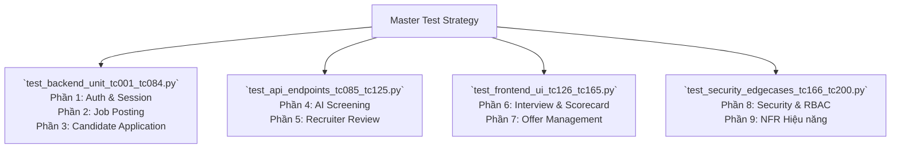

# CHIẾN LƯỢC KIỂM THỬ (TEST STRATEGY) CHO SMART RECRUITMENT ATS

Tài liệu này định nghĩa chiến lược bao phủ **100% các chức năng, luồng nghiệp vụ, giao diện, API, bảo mật và hiệu năng** của toàn bộ hệ thống Smart Recruitment ATS.
Phần chi tiết hơn 200 test cases đã được thống kê và tách sang file `test-cases.md`.

## 1. Các cấp độ kiểm thử (Test Levels)

| Layer | Coverage |
| :--- | :--- |
| **Unit & Backend API** | Kiểm thử logic lõi: Xác thực (Auth), quản lý Job Posting, Nộp hồ sơ (Application upload & validation), giới hạn File Size, RBAC permissions, tính toán Match Score. |
| **Integration & AI** | Tích hợp AI Resume Parser, chuyển đổi State Machine của hồ sơ (Screening -> Interview -> Offer), cơ chế Idempotency chống click đúp. |
| **E2E & UI (Frontend)** | Luồng người dùng từ đăng nhập → Candidate nộp CV → Recruiter phân tích AI → Đặt lịch phỏng vấn → Nhập Scorecard → Quản lý Offer. Các validation trên giao diện. |
| **Security & NFR** | Bảo vệ XSS, SQL Injection, chống IDOR tải CV người khác, chặn rò rỉ Rate Limiting, kiểm tra cấu hình CORS, kiểm tra AI Latency (< 5s). |

## 2. Cấu trúc kịch bản tự động hóa (Automation Test Suite)

Để tối ưu hóa việc quản lý và thực thi, hệ thống Automation Suite (viết bằng **Pytest** và **Playwright**) đã được chia thành 4 phân hệ file vật lý:



## 3. Hướng dẫn thực thi Automation Test

Các câu lệnh để chạy hệ thống kiểm thử:

```bash
# 1. Chạy các test Backend & API lõi
python -m pytest tests/test_backend_unit_tc001_tc084.py -v
python -m pytest tests/test_api_endpoints_tc085_tc125.py -v

# 2. Chạy test Giao diện E2E bằng Playwright
python -m pytest tests/test_frontend_ui_tc126_tc165.py -v

# 3. Chạy test Bảo mật & Edge Cases
python -m pytest tests/test_security_edgecases_tc166_tc200.py -v
```

## 4. Quản lý Lỗi (Defect Management)
- Nếu bất kỳ Test Case nào bị FAIL (nhất là liên quan đến nghiệp vụ lõi hoặc lỗ hổng bảo mật), một file **Bug Report** riêng biệt sẽ được lập tức tạo trong thư mục `docs/07-testing/bug_reports/`.
- Tiêu chuẩn đặt tên file: `BUG-[ID]_[Mã_TC]_[Tên_lỗi].md`.
- Mỗi Bug Report tuân thủ chặt chẽ định dạng gồm: `Summary`, `Environment`, `Reproduction`, `Expected/Actual`, `Root Cause`, `Solution`, `Regression Risk` và `Test Plan`.
