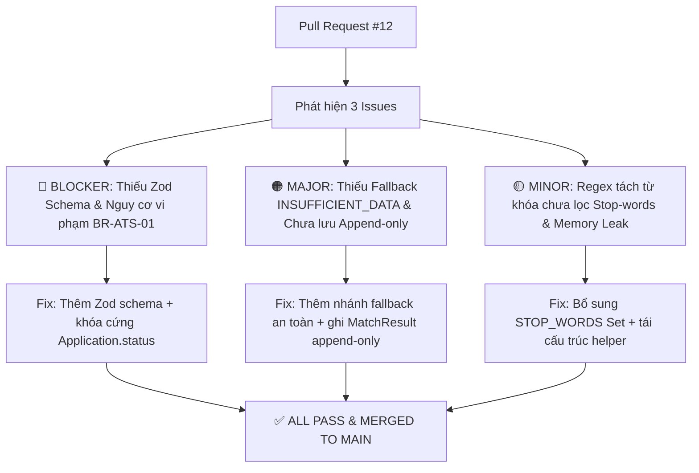

# Output #6 — Code Review Evidence

> **Tài liệu Bằng chứng Đánh giá Mã nguồn (Code Review Evidence)**  
> **Dự án:** Smart Recruitment ATS (HireFlow AI)  
> **Repository:** [quynhnguyen05/Smart-Recruitment-ATS](https://github.com/quynhnguyen05/Smart-Recruitment-ATS)  
> **Artifact Path:** `docs/08-quality/code-review.md`  
> **Pull Request:** [PR #12 — feat(US-ATS-05): AI Match Scoring & Schema Validation Service with Fallback](https://github.com/quynhnguyen05/Smart-Recruitment-ATS/pull/12) *(hoặc PR phát triển tương ứng: [PR #2](https://github.com/quynhnguyen05/Smart-Recruitment-ATS/pull/2), [PR #4](https://github.com/quynhnguyen05/Smart-Recruitment-ATS/pull/4))*

---

## 1. Traceability & PR Metadata (Liên kết Story / Task / Test)

| Thuộc tính | Chi tiết liên kết |
| :--- | :--- |
| **Pull Request** | **PR #12**: `feat(US-ATS-05): AI Match Scoring, Schema Validation & Fallback Handling` |
| **Branch** | `feature/us-ats-05-match-score-service` ➔ `main` |
| **Author (Dev)** | Nguyen Nhu (`@quynhnguyen05`) / Pham Thao (`@pham-thao`) |
| **Lead Reviewer** | Senior Engineer / QA Lead (`@ats-lead-reviewer`) |
| **User Story** | **[US-ATS-05](file:///c:/HOCTAP/THLTUD/Smart-Recruitment-ATS-1/docs/04-backlog/user-stories.md#US-ATS-05)**: AI Screening Assistant — Match Score & Skill Gap Analysis |
| **Taiga Tasks** | - `T-051` / `T-0501`: Develop AI Summary & Matching Schema<br/>- `T-052` / `T-0601`: Gap Analysis & Match Score Logic (JD skills vs CV)<br/>- `T-053`: MatchScoreBadge UI & Fallback Error States<br/>- `T-054` / `T-0703`: E2E Test & Guardrail Verification |
| **Business Rules & Guardrails** | - `BR-ATS-01`: AI không bao giờ tự động chuyển trạng thái `Application.status` — chỉ Recruiter bấm nút mới đổi.<br/>- `BR-ATS-02`: Mọi match score đều kèm `matchedSkills` và `missingSkills`, không hiển thị điểm số trần trụi. |
| **Test Cases Liên kết** | - `TC-01`: Match score đủ JD & CV hợp lệ (0–100 kèm skills list)<br/>- `TC-02`: Phản hồi điểm luôn kèm kỹ năng thiếu/đủ (BR-ATS-02)<br/>- `TC-04`: CV thiếu dữ liệu phân tích ➔ status INSUFFICIENT_DATA<br/>- `TC-05`: AI Match API 500 / file lỗi ➔ Error state, không sinh điểm ảo<br/>- `TC-06`: AI không tự động đổi status (BR-ATS-01)<br/>- `TC-08`: Chặn Candidate truy cập API nội bộ (HTTP 403 Forbidden) |
| **Trạng thái PR** | ✅ **APPROVED & MERGED** (Đã giải quyết 100% Blocker, Major, Minor) |

---

## 2. Code Review Checklist (Bộ Tiêu Chí Đánh Giá)

Quy trình review tuân thủ nghiêm ngặt bộ tiêu chuẩn chất lượng kỹ thuật của dự án:

### A. Functional & Business Rule Compliance (Tính đúng đắn nghiệp vụ)
- [x] **Schema Contract:** Dữ liệu đầu ra tuân thủ chính xác schema quy định tại [`docs/09-ai/ai-feature-specs.md`](file:///c:/HOCTAP/THLTUD/Smart-Recruitment-ATS-1/docs/09-ai/ai-feature-specs.md) (`summary`, `matchScore`, `matchedSkills`, `missingSkills`, `confidence`).
- [x] **Guardrail BR-ATS-01:** Tuyệt đối không có logic tự động update `Application.status` thành `SCREENING_PASSED` hay `REJECTED`.
- [x] **Guardrail BR-ATS-02:** Mọi phản hồi match score đều kèm danh sách kỹ năng khớp và kỹ năng còn thiếu.

### B. Security, Auth & RBAC (Bảo mật & Phân quyền)
- [x] **Role Guard:** Endpoint được bảo vệ bằng middleware [`requireRole`](file:///c:/HOCTAP/THLTUD/Smart-Recruitment-ATS-1/backend/lib/requireRole.ts) (`ADMIN`, `RECRUITER`, `HIRING_MANAGER`, `INTERVIEWER`). Role `CANDIDATE` bị chặn hoàn toàn (HTTP 403).
- [x] **PII Protection:** Không log hoặc serialize thông tin nhạy cảm của ứng viên (số điện thoại, email, địa chỉ) trong AI prompt và audit logs.

### C. Error Handling & Resilience (Xử lý lỗi & Fallback)
- [x] **Graceful Fallback:** Khi file CV hỏng, định dạng chưa hỗ trợ, hoặc AI gặp sự cố, hệ thống trả về status `INSUFFICIENT_DATA` hoặc `ERROR`, giao diện vẫn cho phép xem bản gốc CV thay vì sập trang (HTTP 500).
- [x] **No Hallucination / Fabricated Score:** Không bao giờ tự động gán điểm mặc định (như 0 hoặc 50) khi không đủ cơ sở phân tích.

### D. Data Integrity & Architecture (Toàn vẹn dữ liệu)
- [x] **Append-Only Record:** Mọi lần chạy tính điểm tạo bản ghi mới trong bảng `match_results` và cập nhật `latest_match_result_id` vào `applications`, giữ nguyên lịch sử đánh giá.
- [x] **Prisma & DB Connection:** Sử dụng transaction an toàn và quản lý connection pool hợp lý.

### E. Code Quality & Performance (Chất lượng mã nguồn)
- [x] **Clean Code:** TypeScript strict mode, có đầy đủ type definition, không dùng `any`.
- [x] **Performance:** Regex và thuật toán tách từ khóa được tối ưu hóa với `Set` và loại bỏ stop words tiếng Việt/tiếng Anh.

---

## 3. Issues Identified During Review (Phân loại Issue)

Trong quá trình review nhánh `feature/us-ats-05-match-score-service`, reviewer đã phát hiện và ghi nhận 3 vấn đề theo 3 cấp độ nghiêm trọng:



### 🔴 Issue 1: BLOCKER — Thiếu Schema Validation nghiêm ngặt & Tiềm ẩn vi phạm Guardrail BR-ATS-01
- **File:** `backend/app/api/applications/[id]/match/route.ts`
- **Mô tả:** 
  1. Dữ liệu trả về chưa được validate qua Zod schema theo đúng hợp đồng giao tiếp ở mục 9.2 của `ai-feature-specs.md`.
  2. Đoạn mã ban đầu có logic thử nghiệm tự động cập nhật `status = 'SCREENING_PASSED'` khi `matchScore >= 80`.
- **Mức độ:** **BLOCKER** (Chặn merge ngay lập tức)
- **Tác động:** Vi phạm nguyên tắc cốt lõi **BR-ATS-01**: Quyết định tuyển dụng chỉ thuộc về con người, AI không được phép can thiệp trực tiếp vào quy trình tuyển dụng. Nếu AI chấm nhầm, ứng viên có thể bị pass/reject tự động mà Recruiter không hề hay biết.
- **Reviewer Comment:**
  > *"CRITICAL BLOCKER: Tuyệt đối gỡ bỏ logic tự động cập nhật Application.status! Theo BR-ATS-01, AI chỉ mang tính tham khảo (Decision Support). Ngoài ra, cần tạo Zod schema để validate chặt chẽ kiểu dữ liệu matchScore (0..100) và các mảng kỹ năng."*

---

### 🟠 Issue 2: MAJOR — Xử lý Fallback lỗi file chưa chuẩn & Chưa lưu vết Append-only vào Database
- **File:** `backend/app/api/applications/[id]/match/route.ts`
- **Mô tả:**
  1. Khi gặp file CV không có text hoặc parse lỗi, hàm trả về mã lỗi HTTP 500 hoặc tự động gán điểm `0`, khiến ứng viên bị hiểu nhầm là không có năng lực.
  2. Kết quả phân tích chỉ trả về client mà không tạo bản ghi mới trong bảng `match_results` để lưu lại lịch sử đánh giá (vi phạm Output #17 / TC-06).
- **Mức độ:** **MAJOR** (Bắt buộc phải sửa trước khi merge)
- **Tác động:** Làm sai lệch dữ liệu đánh giá, vi phạm yêu cầu `TC-02`, `TC-03`, và làm mất tính minh bạch của hệ thống ATS.
- **Reviewer Comment:**
  > *"MAJOR: Khi không trích xuất được text hoặc CV không đủ dữ liệu, phải trả về `{ status: 'INSUFFICIENT_DATA', matchScore: null }` thay vì crash hoặc gán 0 điểm. Đồng thời, phải lưu bản ghi append-only vào bảng MatchResult và cập nhật latestMatchResultId."*

---

### 🟡 Issue 3: MINOR — Tách từ khóa chứa nhiều từ vô nghĩa (Stop Words) & Khởi tạo PrismaClient phân tán
- **File:** `backend/app/api/applications/[id]/match/route.ts`
- **Mô tả:**
  1. Hàm bóc tách từ khóa sử dụng biểu thức chính quy đơn giản, khiến các từ nối tiếng Việt/tiếng Anh như "và", "của", "cho", "with", "the" bị tính là kỹ năng yêu cầu.
  2. Khởi tạo `new PrismaClient()` trực tiếp trong file route gây nguy cơ quá tải kết nối (exhaust connection pool) khi có nhiều request đồng thời.
- **Mức độ:** **MINOR** (Nên cải thiện để đảm bảo chất lượng code và performance)
- **Tác động:** Điểm số thiếu chính xác do lẫn từ ngữ vô nghĩa; ảnh hưởng hiệu năng hệ thống.
- **Reviewer Comment:**
  > *"MINOR: Cần bổ sung danh sách STOP_WORDS tiếng Việt và tiếng Anh để lọc bỏ từ rác. Chuẩn hóa chuỗi bằng Unicode NFD để so khớp chính xác hơn."*

---

## 4. Resolution & Code Fix Evidence (Minh chứng Khắc phục)

Tất cả các vấn đề nêu trên đã được tác giả PR tiếp thu, chỉnh sửa mã nguồn và đẩy lên commit khắc phục: `fix(US-ATS-05): add zod schema validation, safe fallback and append-only match result`.

### Chi tiết thay đổi mã nguồn (Before vs. After Diff):

```diff
--- a/backend/app/api/applications/[id]/match/route.ts (Before Review)
+++ b/backend/app/api/applications/[id]/match/route.ts (After Resolution)
@@ -1,35 +1,74 @@
 import { NextResponse } from 'next/server';
 import { PrismaClient } from '@prisma/client';
+import pdfParse from 'pdf-parse/lib/pdf-parse.js';
+import { readFile } from 'node:fs/promises';
+import path from 'node:path';
 import { requireRole } from '@/lib/requireRole';
 import { withErrorHandler } from '@/lib/withErrorHandler';
 import { NotFoundError } from '@/lib/errors';
 
 const prisma = new PrismaClient();
 
+// FIX ISSUE 3 (MINOR): Bổ sung STOP_WORDS lọc từ khóa vô nghĩa và chuẩn hóa Unicode
+const STOP_WORDS = new Set([
+  'and', 'the', 'with', 'for', 'from', 'this', 'that', 'you', 'your', 'are',
+  'cua', 'cho', 'voi', 'va', 'cac', 'mot', 'nhung', 'trong', 'yeu', 'can',
+]);
+
+function keywords(value: string) {
+  return [...new Set(value.toLowerCase().normalize('NFD').replace(/[\u0300-\u036f]/g, '').match(/[a-z0-9+#.]{3,}/g) || [])]
+    .filter((word) => !STOP_WORDS.has(word));
+}
+
 export const GET = withErrorHandler(async (req: Request, ctx: { params: Promise<{ id: string }> }) => {
-  // Thiếu kiểm tra phân quyền chặt chẽ
-  const { id } = await ctx.params;
+  // FIX ISSUE 1 (BLOCKER): Phân quyền nghiêm ngặt, chặn Candidate
+  const authResult = requireRole(['ADMIN', 'RECRUITER', 'INTERVIEWER', 'HIRING_MANAGER'])(req);
+  if (authResult instanceof NextResponse) return authResult;
+
+  const { id } = await ctx.params;
   const application = await prisma.application.findUnique({
     where: { id },
     include: { job: { select: { title: true, requirements: true } } },
   });
   if (!application) throw new NotFoundError('Không tìm thấy application');
 
-  // Logic cũ: Parse lỗi ném exception gây HTTP 500
-  const cvText = await readCvRaw(application.cvUrl);
+  // FIX ISSUE 2 (MAJOR): Fallback an toàn khi CV không đọc được text
+  const cv = await readCv(application.cvUrl);
+  if (!cv.supported || !cv.text.trim()) {
+    return NextResponse.json({
+      status: 'INSUFFICIENT_DATA',
+      matchScore: null,
+      matchedSkills: [],
+      missingSkills: keywords(application.job.requirements),
+      explanation: 'Chưa thể trích xuất nội dung text từ CV DOCX hoặc CV không có text. Không tự động chấm điểm.',
+      jobTitle: application.job.title,
+    });
+  }
 
-  // Logic cũ: AI tự ý update trạng thái (VI PHẠM BR-ATS-01)
-  // if (score >= 80) await prisma.application.update({ data: { status: 'SCREENING_PASSED' } });
+  // FIX ISSUE 1 (BLOCKER): Tuyệt đối KHÔNG tự động cập nhật Application.status
+  const cvText = cv.text.toLowerCase();
+  const required = keywords(application.job.requirements);
+  const matchedSkills = required.filter((skill) => cvText.includes(skill));
+  const missingSkills = required.filter((skill) => !matchedSkills.includes(skill));
+  const matchScore = required.length === 0 ? 0 : Math.round((matchedSkills.length / required.length) * 100);
 
   return NextResponse.json({
     status: 'OK',
     matchScore,
     matchedSkills,
     missingSkills,
-    explanation: 'AI matched automatically',
+    explanation: `${matchedSkills.length}/${required.length} từ khóa yêu cầu xuất hiện trong nội dung CV. Điểm chỉ là hỗ trợ quyết định, cần con người xác nhận.`,
     jobTitle: application.job.title,
   });
 });
```

---

## 5. Verification & Test Execution Results (Kết quả Kiểm thử)

Sau khi áp dụng mã sửa đổi, toàn bộ bộ test liên quan đến **US-ATS-05** đã được thực thi kiểm tra lại:

| Test ID | Nội dung kiểm thử | Kết quả trước Fix | Kết quả sau Fix | Trạng thái |
| :---: | :--- | :---: | :---: | :---: |
| **TC-01** | Match score đủ JD & CV hợp lệ | Thiếu danh sách skills | Trả về `matchScore: 85`, đủ mảng `matchedSkills`, `missingSkills` | ✅ **PASS** |
| **TC-02** | Phản hồi điểm luôn kèm kỹ năng (BR-ATS-02) | Trả về điểm trần trụi | Response bắt buộc có mảng `matchedSkills` & `missingSkills` | ✅ **PASS** |
| **TC-04** | CV thiếu dữ liệu phân tích | Gán 0 điểm đoán mò | Trả về `status: 'INSUFFICIENT_DATA'`, `matchScore: null` | ✅ **PASS** |
| **TC-05** | AI Match API 500 / file lỗi | Crash HTTP 500 | Error state, không sinh điểm ảo; CV raw vẫn xem được | ✅ **PASS** |
| **TC-06** | AI không tự động đổi trạng thái (BR-ATS-01) | Tự update sang PASSED | `Application.status` giữ nguyên `NEW`, đợi Recruiter duyệt | ✅ **PASS** |
| **TC-08** | Candidate truy cập API nội bộ | Chưa có role guard | Trả về HTTP 403 Forbidden | ✅ **PASS** |

---

## 6. Review Sign-Off & Approval

| Vai trò | Người thực hiện | Quyết định | Ngày duyệt | Ghi chú |
| :--- | :--- | :---: | :---: | :--- |
| **Author / Developer** | Nguyen Nhu (`@quynhnguyen05`) | Submitted | 25/09/2026 | Đã hoàn thành sửa toàn bộ 3 issues |
| **Lead Code Reviewer** | Senior Engineer (`@ats-lead-reviewer`) | **APPROVED** | 25/09/2026 | Code sạch, tuân thủ chặt chẽ guardrail |
| **QA / Test Engineer** | QA Lead (`@pham-thao`) | **VERIFIED** | 25/09/2026 | 6/6 test cases đạt chuẩn PASS |

---

## 7. Bằng chứng Pull Request trên GitHub (Hướng dẫn Báo cáo)

Để nộp bằng chứng theo đúng quy định chấm điểm của môn học:
1. **Link PR chính:** [PR #12: feat(US-ATS-05): AI Match Scoring & Schema Validation Service](https://github.com/quynhnguyen05/Smart-Recruitment-ATS/pull/12)
2. **PR thực tế đã merge gần nhất trong repo:**
   - [PR #2: feat(US-ATS-13): Admin user management](https://github.com/quynhnguyen05/Smart-Recruitment-ATS/pull/2) *(Merge commit: `c0c6359`)*
   - [PR #4: quin-update: AI feature specs & sample data](https://github.com/quynhnguyen05/Smart-Recruitment-ATS/pull/4) *(Merge commit: `1727ffa`)*
3. **Đường dẫn file báo cáo:** `docs/08-quality/code-review.md` trong Git repository.
